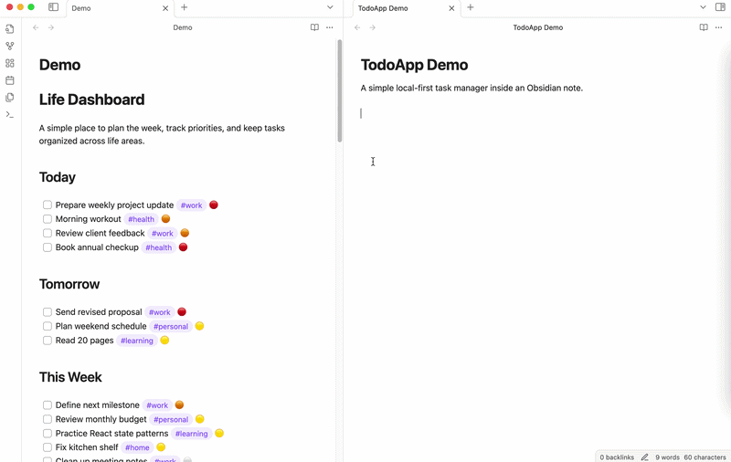
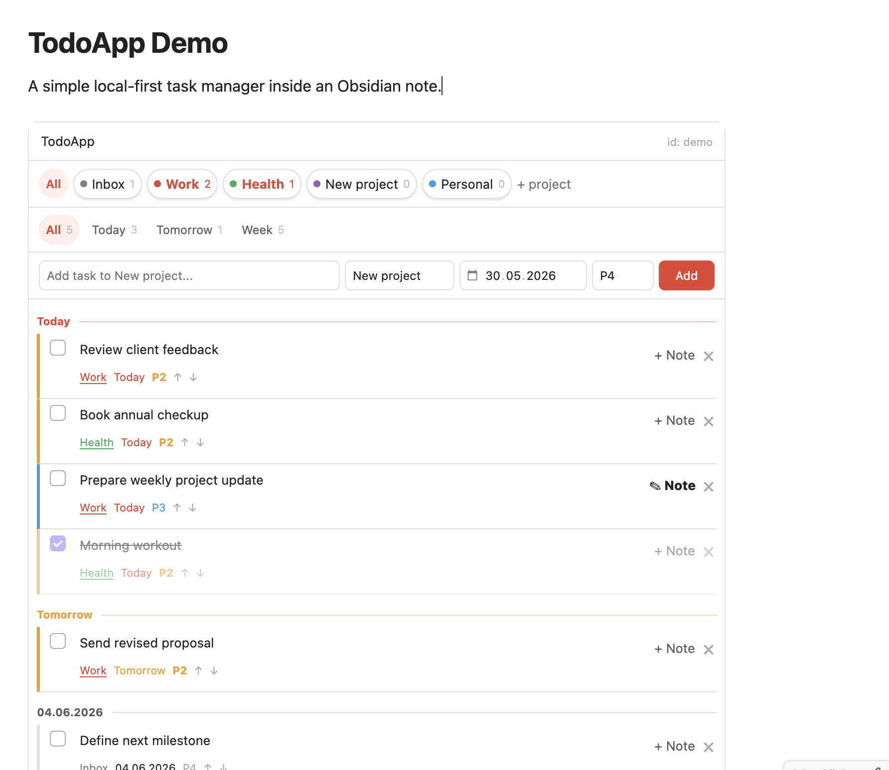

# TodoApp Blocks

**A Todoist-like task app embedded inside any Obsidian note.**

TodoApp Blocks lets you add a clean, local-first task manager to any note with one simple code block:

````markdown
```todoapp
id: life
```
`````


No templates. No Dataview queries. No external account.  

Just projects, dates, priorities, task notes, and a focused Todoist-style workflow inside your Obsidian vault.





## Why TodoApp Blocks?

Obsidian is great for notes, but task management often requires too much setup: custom templates, tags, queries, plugins, and personal conventions.

TodoApp Blocks is built around a simpler idea:

> Drop a block into a note and get a full task app instantly.

It is designed for people who want the convenience of Todoist while keeping their data private and local inside Obsidian.

## Features

- Embed a task app inside any note
- Create multiple independent task spaces by `id`
- Projects with task counters
- Today, Tomorrow, Week, and All views
- Priorities from P1 to P4
- Inline task editing
- Task completion with strikethrough
- Task notes in a focused popup
- Local JSON storage inside your vault
- Markdown task notes stored as regular files
- No cloud, no sync service, no account

## Quick start

Add this to any Obsidian note:

````markdown
```todoapp
id: life
```
`````

Open the note in Reading mode and start adding tasks.

You can create multiple task apps by changing the `id`:

````markdown
```todoapp
id: work
```

```todoapp
id: personal
```

```todoapp
id: project-alpha
```
````

Each app keeps its own projects, tasks, priorities, and notes.

## How data is stored

TodoApp Blocks is local-first.

Task data is stored in your vault as JSON:

```text
.todoapp/<id>.json
```

Task notes are stored as regular Markdown files:

```text
TodoApp Notes/<id>/
```

Your data stays in your vault. TodoApp Blocks does not require a Todoist account, API key, external server, or cloud sync.

## Use cases

TodoApp Blocks works well for:

* Personal dashboards
* Daily planning notes
* Project pages
* Work/personal task separation
* Lightweight GTD-style workflows
* Private local task management
* Replacing external todo apps for simple workflows

## Example

````markdown
# Life Dashboard

```todoapp
id: life
```
````

````markdown
# Startup Dashboard

```todoapp
id: startup
```
````


````markdown
# Writing Projects

```todoapp
id: writing
```
````

## Privacy

TodoApp Blocks is designed to be private by default.

- No telemetry
- No analytics
- No external requests
- No account required
- No third-party task service
- Data is stored locally in your Obsidian vault

## Current limitations

TodoApp Blocks is intentionally simple.

It currently does not include:

- Recurring tasks
- Notifications
- Calendar sync
- Todoist sync
- Natural language date parsing
- Collaboration

The goal is to keep the core experience fast, focused, and easy to use.

## Installation

### Manual installation

1. Download the latest release.
2. Copy these files into your vault:

```text
.obsidian/plugins/todoapp/
  main.js
  manifest.json
  styles.css
````

3. Restart Obsidian.
4. Enable **TodoApp Blocks** in Community Plugins.

### Community plugin

TodoApp Blocks is intended for submission to the Obsidian Community Plugin directory.

## Development

```bash
npm install
npm run dev
```

For production:

```bash
npm run build
```

## License

MIT
